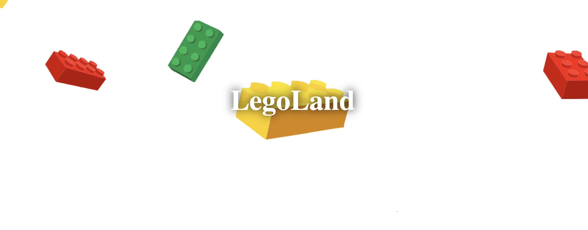

## Exercice : Chute de bricks

Créez une animation pour la chute des briques en utilisant les keyframes CSS.

### Etapes

1. Créez un fichier HTML et ajoutez les éléments qui composent la page (c'est-à-dire les briques).
2. Créez un fichier CSS et ajoutez les styles pour positionner les éléments de la page.
3. Créez une animation pour la chute des briques en utilisant les keyframes CSS.
4. Ajoutez l'animation à l'élément HTML correspondant.

### Rendu

Votre fichier HTML devrait ressembler à ceci :

